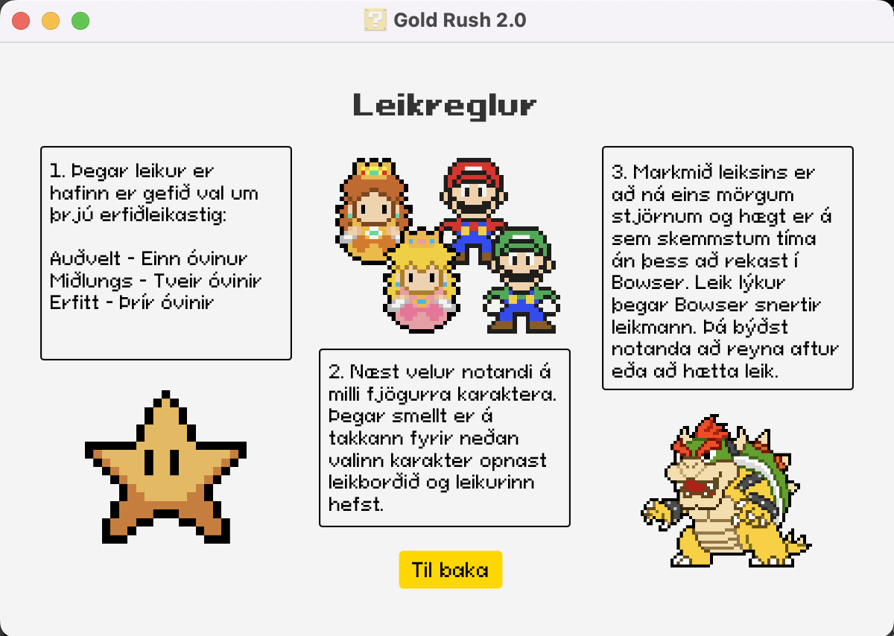
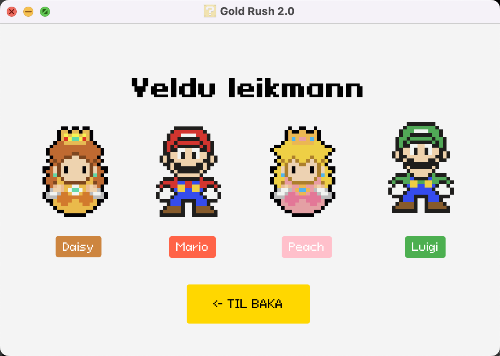
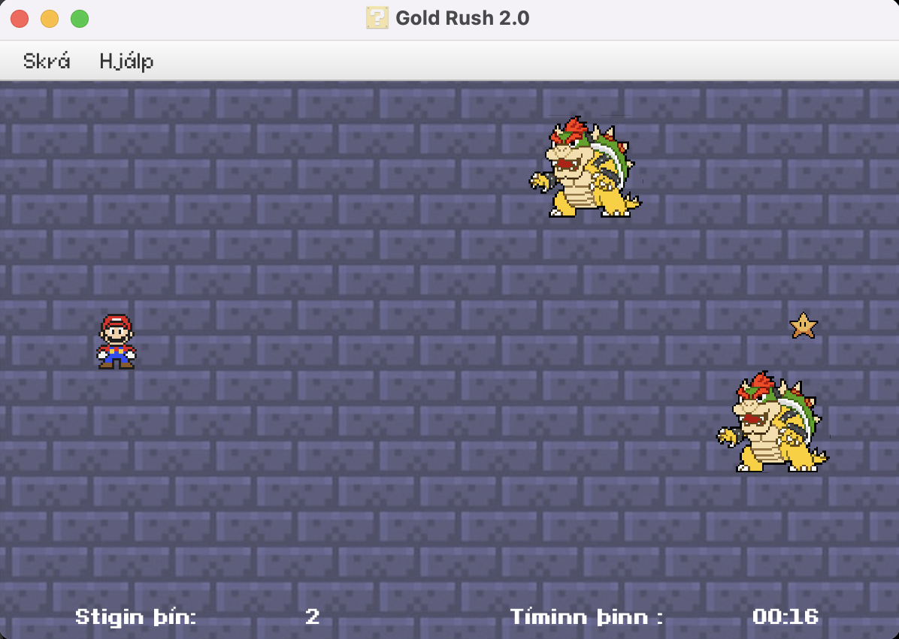

# Version 1.0

Verkefnið er endurbætt útgáfa af GoldRush. Sá leikur var uppáhalds verkefnið hjá öllum þar sem hann gefur marga 
möguleika á að bæta við auka virkni sem gerir leikinn skemmtilegri og fjölbreytnari, og voru því allir sammála 
hvaða verkefni yrði valið.

Þetta verkefnið var frábrugðið hinum verkefnunum þar sem það var tölvuleikur og meira gagnvirkt en hin verkefnin. 
Við höfum allar mismunandi reynslur af tölvuleikjum og því viljum við prófa að útfæra leik á okkar hátt. 
Við vorum komnar með góðan grunn til að vinna með og því skemmtilegra að hugsa um hvernig við getum bætt 
við leikinn til að gera upplifunina fyrir notandann enn skemmtilegri. Viðmótið sjálft var með mestu möguleikana
til að betrumbæta leikinn.

**Allar grunnkröfurnar eru þær sömu en þó nokkrar viðbætur:**
- Hægt er að velja mismunandi persónur sem uppfylla hlutverk grafarans.
- Hægt er að velja erfiðleikastig sem hefur áhrif á hversu margir óvinir birtast.
- Óvinur sem endar leikinn ef grafarinn rekst á hann.
- Breytt var leikjatímanum þar sem hann telur ekki lengur niður heldur telur áfram þangað til þú rekst á óvininn eða hættir í leik.
  
## **Maven uppsetning**
   ### Maven Compiler Plugin:
  Við notuðum Maven source 21, version 3.11.0. (Group ID: org.apache.maven.plugins)
  ### JavaFX Maven Plugin:
  Við notuðum version 0.0.8. (Group ID: org.openjfx)  
  [Sjá nánar í pom.xml](https://github.com/sigrunedda/GoldRush/blob/main/pom.xml)
  
## **Til þess að keyra forritið:**  
  Til þess að keyra forritið með Maven þá fer einstaklingur í Maven -> Plugins -> javafx -> javafx:run
    annars er hægt að keyra það í gegnum GoldApplication og ýta á run current file. 
    _GoldApplication er mainClass_

## **Leikurinn í keyrslu:**

